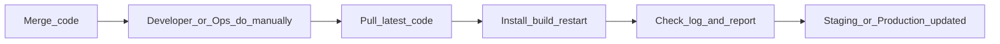
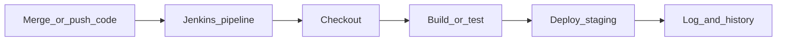

# Kế hoạch seminar Jenkins cơ bản cho team

## Mục tiêu buổi

Buổi này không nhằm dạy toàn bộ Jenkins, mà để team nhìn rất rõ 3 ý chính:

- Nếu **không có Jenkins**, sau khi merge code cho một task thì team phải làm gì để **staging** hoặc **production** nhận code mới.
- Nếu **có Jenkins**, những bước nào được **tự động hóa**, **chuẩn hóa**, và **dễ theo dõi** hơn.
- Demo một thay đổi rất nhỏ để mọi người thấy Jenkins đang thay con người xử lý các bước lặp lại như thế nào.

Thông điệp chính nên chốt ở cuối buổi:

> Không có Jenkins thì release sau merge là một chuỗi thao tác tay. Có Jenkins thì chuỗi đó trở thành một quy trình tự động, có log, có lịch sử, và dễ lặp lại hơn.

---

## Đối tượng & định dạng

- **Đối tượng**: dev/QA/DevOps mới hoặc chưa dùng Jenkins.
- **Thời lượng gợi ý**: **30–45 phút**.
- **Mục tiêu trình bày**: dễ hiểu, ít thuật ngữ, tập trung vào giá trị thực tế hơn là lý thuyết sâu.
- **Demo ưu tiên**: ngắn, chắc thắng, nhìn thấy thay đổi ngay.

---

## Agenda đề xuất

| Phần | Thời gian | Nội dung |
| --- | --- | --- |
| Mở đầu | 3–5 phút | Đặt bài toán: sau khi merge code thì làm sao để staging hoặc production nhận bản mới |
| Không có Jenkins | 7–10 phút | Mô tả quy trình manual: pull code, cài dependency, build, restart, kiểm tra log, báo lại cho team |
| Có Jenkins | 7–10 phút | Mô tả Jenkins tự động hóa các bước trên như thế nào; log, build history, tính lặp lại |
| Demo nhanh | 10–15 phút | Sửa một thay đổi rất nhỏ, trigger Jenkins, xem log, refresh môi trường demo để thấy kết quả |
| Mở rộng & Q&A | 5–10 phút | Jenkins còn làm thêm được gì: test, notification, deploy staging, approval trước production |

---

## Cách kể chuyện của buổi seminar

### 1. Trước tiên không nói Jenkins ngay
Nên bắt đầu bằng một câu hỏi rất thực tế:

> Nếu hôm nay một task vừa được merge xong, ai sẽ làm gì để staging hoặc production có code mới?

Mục tiêu là để mọi người tự nhớ ra quy trình thủ công mà team đang làm hoặc có thể sẽ phải làm.

### 2. Sau đó mới đưa Jenkins vào như lời giải
Jenkins không phải phần mềm “thần kỳ”, mà là công cụ biến các bước thủ công sau merge thành một workflow có thể chạy tự động và có log rõ ràng.

---

## Nếu không có Jenkins thì chuyện gì xảy ra sau khi merge?

Đây là phần nên nói thật gần với thực tế team.

Một flow manual thường sẽ là:

1. Có merge code mới lên nhánh chung.
2. Một người phải vào server hoặc máy build.
3. Kéo code mới về.
4. Cài hoặc cập nhật dependency nếu cần.
5. Chạy build hoặc test thủ công.
6. Copy artifact hoặc restart service/app.
7. Kiểm tra log xem có lỗi không.
8. Báo lại cho team rằng staging hoặc production đã nhận bản mới.

### Điểm đau của cách làm này

- Phụ thuộc vào con người.
- Dễ quên bước.
- Dễ lệch giữa người này và người khác.
- Khó biết ai đã làm gì, lúc nào, fail ở đâu.
- Mỗi task nhỏ vẫn phải đi qua một chuỗi thao tác lặp lại.

Có thể trình bày bằng sơ đồ rất đơn giản:

---

## Nếu có Jenkins thì khác như thế nào?

Khi có Jenkins, chuỗi thao tác lặp lại ở trên có thể được tự động hóa thành pipeline.

Flow đơn giản:

1. Dev merge hoặc push code.
2. Jenkins phát hiện có thay đổi hoặc được bấm build.
3. Jenkins checkout code.
4. Jenkins chạy build hoặc test theo rule đã định nghĩa.
5. Jenkins deploy lên môi trường demo hoặc staging.
6. Jenkins lưu log và trạng thái pass/fail.

### Giá trị Jenkins mang lại

- **Nhanh hơn**: giảm thao tác tay.
- **Ổn định hơn**: cùng một pipeline chạy theo cùng một cách.
- **Minh bạch hơn**: có console log, có build history.
- **Dễ mở rộng hơn**: sau này thêm test, notification, deploy nhiều môi trường, approval.

Sơ đồ minh họa:

---

## Jenkins là gì theo cách dễ hiểu

Chỉ cần giải thích ngắn:

- Jenkins là một **automation server**.
- Jenkins giúp chạy tự động các bước mà bình thường con người phải làm sau khi code thay đổi.
- Các bước đó có thể được mô tả bằng **pipeline** hoặc file `Jenkinsfile`.

Không cần đi sâu vào plugin hay kiến trúc phức tạp trong buổi này.

---

## Demo nên thiết kế như thế nào?

### Mục tiêu demo
Không phải chứng minh Jenkins có mọi tính năng, mà chỉ cần cho team thấy:

- có thay đổi nhỏ trong code
- Jenkins chạy một chuỗi bước tự động
- môi trường demo nhận thay đổi mới

### Nguyên tắc chọn demo

- App càng nhỏ càng tốt.
- Build càng nhanh càng tốt.
- Thay đổi càng dễ nhìn càng tốt.
- Số lượng bước trong pipeline càng ít càng tốt.

### Demo task gợi ý

Chọn một trong các kiểu sau:

#### Cách 1: đổi text trên trang
- Ban đầu trang hiển thị: `Welcome version 1`
- Sửa thành: `Welcome version 2`
- Jenkins build và deploy
- Refresh môi trường demo để thấy text mới

#### Cách 2: đổi message ở endpoint
- Endpoint trả: `Hello from build 1`
- Sửa thành: `Hello from build 2`
- Jenkins chạy build/deploy
- Mở trình duyệt hoặc curl để thấy dữ liệu mới

#### Cách 3: bật/tắt một chức năng cực nhỏ
- Ví dụ đổi label nút hoặc thêm một đoạn text “New feature enabled”
- Mục tiêu là thay đổi nhìn thấy được ngay, không cần giải thích logic nghiệp vụ dài

Khuyến nghị: **ưu tiên đổi text hoặc đổi message** vì dễ hiểu nhất với audience.

---

## Demo flow đề xuất trong buổi

### Bước 1. Cho mọi người xem trạng thái hiện tại
Mở app hoặc endpoint đang chạy trên môi trường demo.

### Bước 2. Nhắc lại flow nếu không có Jenkins
Nói rất ngắn:

- merge xong
- phải vào server kéo code
- build
- restart
- kiểm tra log
- báo lại kết quả

### Bước 3. Mở Jenkins
Chỉ vào job hoặc pipeline đã chuẩn bị sẵn.

### Bước 4. Tạo thay đổi rất nhỏ
Ví dụ đổi text từ `version 1` sang `version 2`.

### Bước 5. Trigger build
Có thể dùng một trong hai cách:

- **Manual build**: đơn giản nhất, chắc thắng nhất
- **Poll SCM**: nếu muốn cho thấy Jenkins có thể tự phát hiện thay đổi

Khuyến nghị cho buổi này: **manual build là đường chính**, `Poll SCM` là phần cộng thêm nếu đã chuẩn bị sẵn.

### Bước 6. Mở console log
Chỉ cho team thấy các bước đại loại như:

- checkout source
- install hoặc prepare
- build
- deploy/copy/restart

### Bước 7. Refresh môi trường demo
Cho mọi người thấy thay đổi đã xuất hiện.

### Bước 8. Kết luận ngay lập tức
Nói rõ:

> Jenkins vừa thay con người thực hiện chuỗi bước kỹ thuật sau khi code thay đổi.

---

## Pipeline nên đơn giản đến mức nào?

Cho buổi basic này, pipeline chỉ nên có 3 bước chính:

1. `Checkout`
2. `Build` hoặc `Prepare`
3. `Deploy to demo/staging`

Nếu muốn thêm kiểm tra, chỉ thêm một bước rất nhẹ như:

4. `Smoke check`

Không nên nhồi quá nhiều stage như lint, unit test, security scan, artifact archive nếu chúng làm demo chậm hoặc dễ fail.

---

## Hạ tầng demo nên chọn thế nào?

### Mục tiêu là nhanh và ổn định
Nếu vẫn dùng Jenkins trên EC2 thì nên tối giản:

- Jenkins đã cài sẵn trước buổi hoặc gần như sẵn sàng
- Chỉ cần 1 máy Jenkins là đủ
- App demo nhỏ, build nhanh
- Không biến webhook hay credentials thành phần bắt buộc của demo live

### Trigger khuyến nghị
Ưu tiên theo thứ tự:

1. **Manual build** — ít rủi ro nhất
2. **Poll SCM** — đủ để minh họa tự động hóa ở mức basic
3. **Webhook** — chỉ dùng nếu đã test rất chắc

### Repo khuyến nghị
- Dùng repo đơn giản, ít dependency.
- Nếu muốn giảm rủi ro tối đa, dùng repo public hoặc repo đã cấu hình credentials xong từ trước.

---

## Checklist chuẩn bị trước buổi

### Checklist nội dung
- [ ] Có câu chuyện mở đầu: sau merge thì staging hoặc production nhận code mới bằng cách nào
- [ ] Có danh sách rõ các bước manual khi chưa có Jenkins
- [ ] Có flow tương ứng khi dùng Jenkins
- [ ] Có câu chốt lợi ích: nhanh hơn, ổn định hơn, minh bạch hơn
- [ ] Có ví dụ Jenkins còn mở rộng được gì sau mức basic

### Checklist kỹ thuật
- [ ] Jenkins vào UI được ổn định
- [ ] Job hoặc pipeline đã chạy pass ít nhất một lần
- [ ] Repo demo pull/checkout được
- [ ] App demo đang chạy sẵn ở trạng thái ban đầu
- [ ] Có sẵn thay đổi nhỏ để demo
- [ ] Có sẵn build history thành công để fallback nếu live demo chậm
- [ ] Có thể bấm manual build ngay nếu trigger tự động không hoạt động

### Checklist demo story
- [ ] Bắt đầu bằng pain point không có Jenkins
- [ ] Liệt kê 4–6 bước manual ngắn gọn
- [ ] Map từng bước manual sang Jenkins automation
- [ ] Chạy demo thay đổi nhỏ
- [ ] Mở log và giải thích Jenkins đang làm gì
- [ ] Refresh môi trường demo để thấy kết quả
- [ ] Kết bằng các khả năng mở rộng sau này

---

## Những gì Jenkins tối ưu được và có thể làm thêm

Sau khi team hiểu phần cơ bản, có thể nói thêm ngắn gọn rằng Jenkins còn giúp:

- tự chạy test trước khi deploy
- gửi thông báo Slack/email khi build fail hoặc pass
- deploy staging tự động sau merge
- cần approval trước khi deploy production
- lưu lịch sử build để audit
- chuẩn hóa release cho nhiều service

Điểm cần nhấn mạnh là:

> Jenkins trước hết giải quyết bài toán lặp lại và dễ sai; sau đó mới là nền tảng để mở rộng CI/CD nghiêm túc hơn.

---

## Q&A gợi ý

- Jenkins khác gì với việc SSH lên server chạy tay?
- Jenkins có bắt buộc phải deploy production không?
- Nếu team nhỏ thì Jenkins có đáng dùng không?
- Jenkins khác gì GitHub Actions ở mức cơ bản?
- Khi nào nên thêm test, approval, notification?

---

## Kết luận

Buổi seminar này nên được nhớ bằng một thông điệp rất đơn giản:

- **Không có Jenkins**: sau khi merge, con người phải tự làm các bước release.
- **Có Jenkins**: các bước đó trở thành một workflow tự động, có log, có lịch sử, và chạy nhất quán hơn.
- **Demo thay đổi nhỏ** là đủ để team thấy ngay giá trị thực tế của Jenkins.
