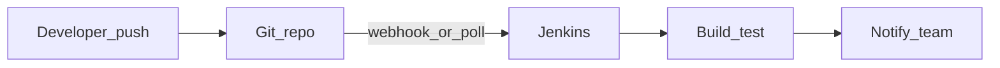
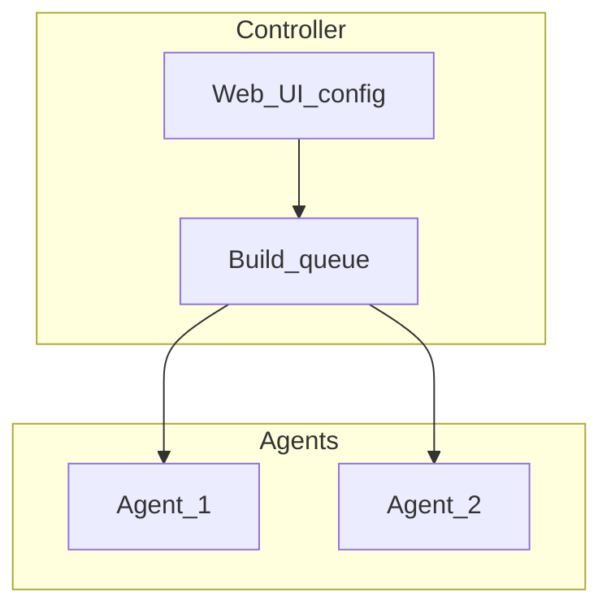
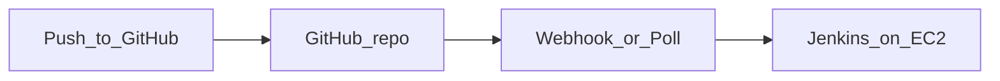

# Kế hoạch seminar Jenkins cơ bản cho team

## Mục tiêu buổi

- Team hiểu **Jenkins giải quyết vấn đề gì** (tự động hóa build/test/deploy, lặp lại có kiểm soát).
- Nắm **các khối chính**: controller, agent, job/pipeline, trigger, artifact/log.
- Biết **chỗ Jenkins đứng** trong quy trình phát triển (kết nối Git, chạy script, báo kết quả).
- **Lab (theo yêu cầu)**: có **repo GitHub nhỏ** + **Jenkins trên EC2** để team **thấy build chạy khi có thay đổi** và cách **cấu hình xác thực** GitHub → Jenkins.

Không bắt buộc đi sâu plugin, bảo mật nâng cao, hay Kubernetes — có thể ghi chú “sẽ nói thêm ở buổi sau” nếu team quan tâm.

## Đối tượng & định dạng

- **Đối tượng**: dev/QA/DevOps mới hoặc chưa dùng Jenkins.
- **Thời lượng gợi ý**: **45–60 phút** (30–40 phút nội dung + 10–15 phút demo + 5–10 phút hỏi đáp).
- **Tài liệu**: slide tối giản (1 khái niệm/slide) hoặc bảng trắng + sơ đồ.

---

## Chương trình chi tiết (agenda)

| Phần             | Thời gian  | Nội dung                                                                                                                                   |
| ---------------- | ---------- | ------------------------------------------------------------------------------------------------------------------------------------------ |
| Mở đầu           | 3–5 phút   | Vì sao cần CI/CD; Jenkins là “máy chủ tự động hóa” chạy các bước theo định nghĩa sẵn.                                                      |
| Jenkins làm gì   | 10–12 phút | Build, test, lint, package, deploy (tùy policy); thông báo (email/Slack); lưu log/artifact; có thể tích hợp nhiều bước trong một pipeline. |
| Hoạt động ra sao | 15–18 phút | Kiến trúc tổng quan, job vs pipeline, trigger, workspace. (Chi tiết bên dưới.)                                                             |
| Demo (lab)       | 15–25 phút | Repo GitHub + Jenkins EC2: cấu hình job/pipeline, xác thực, push code → build tự chạy (poll hoặc webhook).                                 |
| Q&A              | 5–10 phút  | Thu thập câu hỏi về môi trường thực tế của team.                                                                                           |

---

## Phần cốt lõi: “Hoạt động ra sao”

### 1. Vị trí trong luồng làm việc

- Developer đẩy code lên Git.
- Jenkins **kích hoạt** (webhook khi có push, hoặc poll định kỳ).
- Jenkins **checkout** code, chạy các bước đã khai báo, **ghi log**, (tuỳ chọn) lưu artifact.
- Kết quả có thể gửi ra kênh chat hoặc hiển thị trên dashboard.

### 2. Kiến trúc (từ vựng tối thiểu)

- **Controller (master)**: lưu cấu hình job, điều phối build, UI.
- **Agent (node / executor)**: máy (hoặc container) thực sự chạy lệnh; có thể cùng máy với controller (nhỏ) hoặc tách ra (scale).
- **Job**: một đơn vị công việc (Freestyle) hoặc **Pipeline** (Jenkinsfile — “pipeline as code”).
- **Workspace**: thư mục làm việc cho mỗi lần chạy (thường xóa/sạch giữa các build tùy cấu hình).

Một sơ đồ đơn giản để vẽ trên slide:

### 3. Khác biệt ngắn: Freestyle vs Pipeline

- **Freestyle**: cấu hình trên UI, phù hợp job đơn giản.
- **Pipeline (Declarative/Scripted)**: mô tả bước trong `Jenkinsfile`, version cùng repo — dễ review và tái lập môi trường.

Chỉ cần 1–2 ví dụ pseudo (không cần dòng lệnh đầy đủ): `stage('Build')`, `stage('Test')`.

---

## Lab thực tế: GitHub + Jenkins trên EC2

Mục tiêu: team **nhìn thấy** push lên GitHub → Jenkins **checkout và chạy pipeline**; hiểu **chỗ cần xác thực** (clone repo private / API nếu dùng plugin GitHub).

### 1. Repo GitHub nhỏ (project demo)

- **Nội dung tối thiểu**: `README.md`, `**Jenkinsfile`** (Declarative: 2–3 `stage`, ví dụ `Checkout` implicit, `Build`, `Test`).
- **Stack gợi ý**: Node (`npm ci` + `npm test`) hoặc Java (`mvn test`) — chọn một thứ team quen để cài toolchain trên EC2 một lần.
- **Nhánh**: `main` (hoặc `master`), pipeline trỏ đúng branch.
- **Public vs private**:
  - **Public**: Jenkins clone qua HTTPS **không cần** credential cho clone (seminar đơn giản nhất).
  - **Private**: bắt buộc **Credentials** trong Jenkins: **PAT** (HTTPS) hoặc **SSH private key** (khuyến nghị deploy key chỉ repo đó).

### 2. Cài Jenkins trên EC2 (AWS)

- **EC2**: instance nhỏ đủ demo (ví dụ `t3.small`), OS phổ biến (**Ubuntu 22.04** hoặc Amazon Linux 2023).
- **Security Group**:
  - **SSH (22)** từ IP của anh (hoặc VPN), không `0.0.0.0/0` mở rộng nếu tránh được.
  - **HTTP**: mở **8080** (Jenkins mặc định) **chỉ khi** cần demo UI/webhook từ ngoài — hoặc hẹp theo nhu cầu; production nên dùng **Nginx/ALB + HTTPS**, không để 8080 public lâu dài.
- **Cài đặt**: cài **Java** (phiên bản Jenkins LTS yêu cầu), thêm repo Jenkins chính thức, cài **Jenkins LTS**, `systemctl enable --now jenkins`.
- **Lần đầu**: lấy **initial admin password** từ file trên server, chạy wizard, cài **plugin gợi ý**, tạo admin user.
- **Trên agent**: cài thêm **Node** hoặc **Maven** tùy `Jenkinsfile` (hoặc dùng **Docker agent** — tăng độ phức tạp; seminar basic có thể bỏ qua).

### 3. Job / Pipeline trong Jenkins trỏ tới GitHub

- Tạo **Pipeline** từ **SCM**: URL repo GitHub, branch, path `Jenkinsfile`.
- Gắn **Credentials** (nếu repo private) vào phần checkout SCM.
- **Build now** lần đầu để xác nhận clone + stage chạy OK trên EC2.

### 4. “Build khi có thay đổi” — hai hướng (chọn một cho seminar)

| Cách               | Ưu điểm                                                            | Lưu ý                                                                                                                                                                                                                               |
| ------------------ | ------------------------------------------------------------------ | ----------------------------------------------------------------------------------------------------------------------------------------------------------------------------------------------------------------------------------- |
| **Poll SCM**       | Không cần GitHub gọi vào Jenkins; không cần URL public cho webhook | Trễ vài phút tùy cron; ít “real-time”                                                                                                                                                                                               |
| **GitHub webhook** | Push là build gần như ngay                                         | Jenkins phải **có URL công khai** (public IP + mở port, hoặc domain + reverse proxy). Cài **GitHub plugin** / cấu hình webhook trong repo (Settings → Webhooks) trỏ `http://EC2_PUBLIC:8080/github-webhook/` (đường dẫn tùy plugin) |

- Seminar **basic**: thường **Poll SCM** (`H/2 * `* * * hoặc tương đương) là đủ để demo “đổi code → vài phút sau build”.
- Muốn **đúng nghĩa webhook**: chuẩn bị trước **Elastic IP** + SG mở 8080 (hoặc 443) và test webhook từ GitHub (tab Recent Deliveries).

### 5. Luồng tổng quát (để vẽ slide)

---

## Gợi ý demo trong buổi (sau khi lab đã setup)

1. **Build now** thủ công — log console: checkout → build → test.
2. **Sửa README hoặc code nhỏ** → push → chờ poll/webhook → build mới xuất hiện.
3. **Một lần fail cố ý** (test fail) để team thấy build đỏ và log.

---

## Gợi ý demo cũ (nếu không dùng EC2)

Nếu chưa có server: slide chụp màn hình hoặc Jenkins Docker local — nhưng với mục tiêu hiện tại, **EC2 + GitHub** là đường chính.

---

## Checklist trước buổi

- **AWS**: EC2 + SG + (tuỳ chọn) Elastic IP; ghi lại URL/IP Jenkins cho slide.
- **GitHub**: repo demo + `Jenkinsfile`; quyết định public (nhanh) hay private (cần PAT/SSH).
- **Jenkins**: plugin Git (và GitHub nếu dùng webhook), job pipeline SCM, credentials đã test.
- **Trigger**: poll **hoặc** webhook đã bắn thử ít nhất một lần thành công.
- Stack team (Node/Java) khớp với những gì đã cài trên EC2.
- Q&A sẵn: Jenkins vs GitHub Actions; vì sao webhook cần Jenkins reachable; hạn chế mở port công khai.

---

## Tài nguyên tham khảo (cho anh đẹp zai chuẩn bị slide)

- Tài liệu chính thức: [Jenkins User Handbook](https://www.jenkins.io/doc/book/) (Getting started, Pipeline, Using Jenkins).
- Không cần đọc hết — chỉ lấy định nghĩa và sơ đồ khớp với agenda trên.

---

## Kết luận

Buổi này đủ để team **hiểu bức tranh lớn** và **từ vựng cơ bản**; phần nâng cao (plugin, credentials, multi-branch, agents trên K8s) nên tách buổi riêng hoặc phần appendix nếu thời gian cho phép.